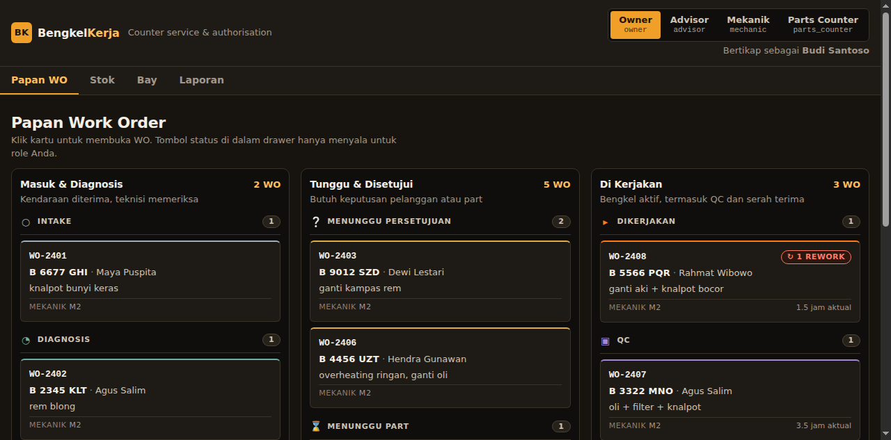
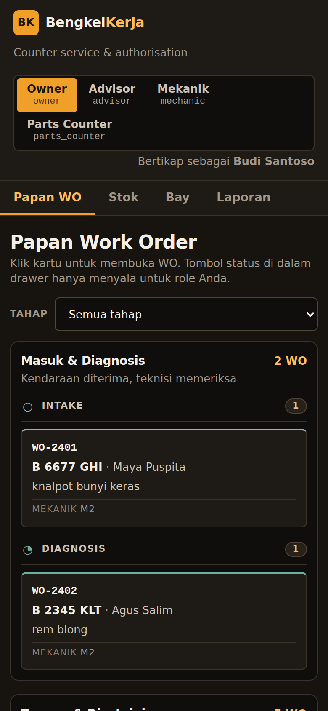

# BengkelKerja

Work-order system for a small Indonesian motorcycle repair shop (*bengkel*): one vehicle comes in,
gets diagnosed, quoted, approved, worked on a lift, checked, invoiced, and handed back.

The interesting part is not the CRUD. It is that **a bay cannot be double-booked**, **approved parts
are actually reserved against stock**, and **the invoice can only ever equal the approved estimate
plus the approved variations** — all three enforced by the database, not by application code that
forgets to check.



<details>
<summary>Mobile (390 px)</summary>



</details>

## The problem it solves

A workshop loses money in ways a spreadsheet cannot see:

- Two jobs get booked onto the same lift at 13:00 and one of them silently slips a day.
- A mechanic promises a customer a part that is not on the shelf, so the job stalls in
  `awaiting_parts` and the customer is called twice.
- A fault is found mid-job. The extra work gets done, but the invoice is rebuilt from the original
  quote — so the shop eats the cost, or worse, charges for work the customer never approved.
- QC fails, the job goes back to the mechanic, and nobody counts the rework.

## Target user

The service advisor standing at the counter with a customer waiting, plus the mechanic who needs to
know which lift is free. Indonesian UI throughout; money in integer rupiah.

## Core workflow

```
intake ──▶ diagnosis ──▶ awaiting_approval ──▶ approved ──┬─▶ awaiting_parts ──┐
             (checklist,  │        (estimate sent)        │  (shortage → order) │
              complaint)   │                              │                     │
                         reject ──▶ cancelled              └─▶ in_progress ◀─────┘
                                                                    │
                                                                  qc ──┤ fail ──▶ in_progress
                                                                    │  (rework_count++)
                                                                  pass
                                                                    ▼
                                                    ready ──▶ completed + invoice
```

- **Intake** requires a four-item checklist (complaint recorded, vehicle inspected, mileage,
  photos) before the job can even be diagnosed. A gate that exists because "the mechanic said it was
  fixed" is how shops lose track.
- **Approval reserves stock.** Each parts line takes `reserved` from `on_hand`. A shortage opens an
  **order part** (supplier, ETA) and parks the job in `awaiting_parts` with the ETA visible.
- **A variation** found during work pauses the job for a fresh approval. The original estimate is
  immutable once approved, so the invoice keeps both records.
- **QC failure** returns the job to `in_progress` and increments `rework_count`, which is the only
  quality signal the shop has.

## Screens

| Screen | What it shows |
|---|---|
| **Papan WO** | Board grouped by stage. Cards carry plate, customer, complaint, mechanic, rework badge, and a blocked-until marker with the parts ETA. |
| **Job drawer** | Everything about one job: role-aware state actions, estimates and lines, reservations, order parts, bay booking, QC, invoice, and the full state-log timeline. |
| **Stok** | `on_hand`, `reserved`, `available` (= on_hand − reserved), reorder point, LOW badge, stock correction, and open order-parts receiving. |
| **Bay** | Per-lift 15-minute grid for one day, with the booking form. A collision returns HTTP 409 and the server's own message is displayed. |
| **Laporan** | Bay utilisation, jobs by state, cycle time, rework rate, revenue, and a printable invoice. |

### The role switcher is a feature, not a decoration

Pick a role in the header and the state-action buttons change. Illegal edges for your role are shown
**disabled with the reason**, not hidden:

> `role 'advisor' may not move a job intake -> diagnosis` — `allowedRoles: ["mechanic", "owner"]`

That is the authorisation model, visible. The backend enforces it independently; the UI just refuses
to lie about what will happen.

## Architecture

One repository, one process, no build step.

```
bengkel-kerja/
├── backend/
│   ├── data/                 # SQLite file (gitignored)
│   ├── src/
│   │   ├── schema.sql        # every table, CHECK, index and trigger
│   │   ├── db.js             # connection, pragmas, tx(), error types
│   │   ├── state-machine.js  # transitions + allowed roles
│   │   ├── seed.js           # one realistic day of work
│   │   ├── auth.js           # x-role header → role (demo, see Security)
│   │   ├── repo/             # stock, bays, jobs, estimates, invoices, reports
│   │   └── http/             # node:http router, 31 routes
│   └── test/                 # 44 node:test cases
├── database/schema.sql       # copy of the schema, for readers
├── frontend/                 # static: index.html + CSS + ES modules
│   ├── tokens.css            # every colour, space and type step
│   ├── app.css
│   └── js/                   # api, dom, fsm, board, drawer, stock, bays, reports, app
├── docs/
└── index.mjs                 # makes `node --test backend/test/` work (see Testing)
```

**Node 22 standard library only — zero npm dependencies.** `node:http` for the server, `node:sqlite`
for the database, `node:test` for the suite. The frontend is plain HTML, CSS and ES modules served by
the same process. No framework, no bundler, no `npm install` step to reproduce.

### Why SQLite, and what it costs

SQLite is not a compromise here, it is the tool that lets the invariants live in the schema:

- `CHECK (reserved <= on_hand)` — stock cannot be over-reserved even if application code is wrong.
- `PRIMARY KEY (bay_id, block_no) WITHOUT ROWID` — an overlapping booking is a **duplicate primary
  key**, so the database refuses it inside the `INSERT`. There is no read-then-write race window,
  because there is no read.
- Partial unique indexes for "one live booking per slot", "one open variation per job", "one active
  reservation per estimate line", "one invoice per job".
- `BEFORE UPDATE/DELETE` triggers freeze lines of an approved estimate.

Postgres would give you `EXCLUDE USING gist` for bay overlap. SQLite cannot express that directly,
and the block table achieves the same guarantee more strongly — the overlap is rejected by the same
statement that would have created it.

**What it costs:** one writer at a time (WAL + `BEGIN IMMEDIATE`, which is fine for one shop and
would need Postgres at three or more shops writing concurrently), no network access to the database
from another host, and no `pg_dump`-style tooling. Documented in Trade-offs rather than hidden.

## Database

Money is **integer rupiah** everywhere. No floats touch a price, a total or a tax figure, in the
database, the API or the tests.

Key entities: `customers` → `vehicles` → `jobs` → (`estimates` → `estimate_lines`) →
(`part_reservations`, `order_parts`, `part_consumptions`) → (`bay_bookings`, `bay_block`) →
(`qc_checks`, `core_returns`) → `invoices` → `invoice_lines`, with `job_state_log` recording every
transition with actor and role.

The seeded day, `Berkat Jaya Motor`, Tuesday 2026-03-10, has 12 jobs spanning every state including
a completed-and-invoiced job with an approved variation, a core-return credit and a discount; a job
parked on a parts shortage; a job paused on a pending variation; and a job that failed QC once.

## Testing

```
$ node --test backend/test/
# tests 44
# pass 44
# fail 0
```

44 cases covering the business rules rather than the HTTP surface:

- **Stock ceiling** — `CHECK` plus a guarded `UPDATE` that asserts the affected-row count, so a
  rejected reservation is a failure, not a silent no-op.
- **Reservation lifecycle** — approve reserves every parts line in one transaction; a shortage takes
  what exists and orders the rest; cancel releases every active reservation exactly once (a second
  release throws instead of quietly succeeding); consume deducts and clears the reservation.
- **Bay double-booking** — rejected by the database, verified through raw SQL as well as the repo
  layer. Adjacent bookings and the same time on a different bay both succeed. Shortening a booking
  frees its tail and the freed slots are immediately rebookable.
- **Invoice identity** — total equals approved estimate + approved variations, asserted as exact
  integer equality before the row is inserted. An unapproved or rejected variation provably cannot
  appear on an invoice.
- **State machine** — illegal edges rejected; terminal states (`completed`, `cancelled`) refuse
  further transitions both through the app and through direct SQL; QC failure increments rework
  exactly once; a mechanic cannot approve their own quote.
- **HTTP boundary** — unknown role 401, forbidden role 403 with `allowedRoles`, malformed JSON 400,
  array-instead-of-object 400, body over 256 KB 400.

`index.mjs` exists for one reason: on Node 22.23.3 `node --test backend/test/` does not recurse
into a directory, it resolves the path as a module. The file makes the documented command run every
test. Bare `node --test` from the root runs the same suite.

## Security

Demo authentication only, and it says so: the API reads `x-role` (`owner`, `advisor`, `mechanic`,
`parts_counter`) and optional `x-staff`, validated against an allow-list, defaulting to `owner`.
There are no passwords, no sessions and no tokens, because this is a solo showcase repo and the
interesting claims are about inventory and scheduling invariants, not identity. A real deployment
needs signed sessions; the header is the seam where that would go.

What *is* enforced:

- Every query is parameterised — `?state=intake' OR 1=1--` returns an empty set, not a leak.
- The role allow-list rejects anything unknown with 401 before routing.
- Request bodies are capped at 256 KB and must be JSON objects.
- Static file serving refuses path traversal (`../`, percent-encoded variants included).
- No secrets, tokens or credentials in the repository; `backend/data/` is gitignored.

Vehicle plates, customer names and phone numbers are PII and are stored as-is because this is a
local demo. A real shop needs retention rules and access logging.

## Local development

Requires Node 22.5 or newer. Nothing to install.

```bash
node backend/src/http/server.js      # http://127.0.0.1:3000, seeded on first run
PORT=4310 node backend/src/http/server.js
node --test backend/test/
```

The UI is Indonesian. The code comments are English.

## Deployment

**Frontend: live on Vercel — https://bengkel-kerja.vercel.app (project root `frontend/`,
static, no build step). Backend: GitHub only.**

Production has **no backend**: every `/api/*` call fails and the UI renders its honest error
blocks (status 404 plus the local-server hint) — no fake API, no invented data. The backend runs
locally per the Run section. The backend is a single Node process with a SQLite file; it is
intentionally *not* deployed, because one shop does not need a backend-as-a-service and a SQLite
file on Vercel's ephemeral filesystem would lose data on every cold start. Moving to Postgres and
a host is a documented upgrade path, not a deployment step taken for show.

## Trade-offs

- **Conflicts are rejected, never auto-reflowed.** Moving a booking that collides returns 409 and
  asks the user to pick another slot. Silent reflow would move a customer's job without telling them.
- **Invoice identity is enforced in transaction code, not a `CHECK`.** A `CHECK` cannot span rows, so
  "total always equals approved + approved variations" has to be an assertion inside the transaction
  that builds the invoice. It is asserted before the insert and covered by a test per rule.
- **Estimates are frozen with triggers, not application guards.** If a future caller writes to the
  database directly, the trigger still holds.
- **Bay utilisation counts booked blocks against opening hours**, so a booking outside 08:00–18:00
  is recorded honestly rather than clamped.
- **Wall-clock time is WIB (+07:00) and stated explicitly** in the frontend, because the same
  screenshot and the same booking must not move depending on the viewer's timezone.

## Interview questions

Answers below are grounded in the code paths named.

**Why time blocks instead of a `SELECT … WHERE start < ? AND end > ?` overlap check?**
A range query is a read followed by an insert, so two concurrent requests can both read "free" and
both insert. `bay_block` has `PRIMARY KEY (bay_id, block_no)`; an overlapping booking tries to
insert a key that already exists and the database rejects it inside the same statement. The race
window is closed by construction, not by a lock. Verified with raw SQL in
`backend/test/bays.test.mjs`.

**Why is the invoice total not a database constraint?**
Because the rule spans rows: `total == SUM(approved estimates) + SUM(approved variations) − discount − core_credit`, and tax. A `CHECK` sees one row. It is built and asserted inside one transaction in `repo/invoices.js`, and `test/invoices.test.mjs` asserts exact integer equality for the identity, for an excluded unapproved variation, and for core-return credit.

**What happens if a part is reserved and the customer cancels?**
`release` runs in the cancellation transaction and clears each active reservation exactly once. It
guards on affected rows: a second release updates zero rows and throws, so a double-release cannot
silently decrement someone's stock. See `repo/stock.js` and `test/stock.test.mjs`.

**How do you prevent a mechanic approving their own quote?**
The transition table carries the allowed roles per edge, and approval of an estimate is refused for
the role that raised it. The UI disables the button and shows the server's reason; the server
returns 403 independently, so bypassing the UI changes nothing.

**Why integer rupiah and not decimals?**
Indonesian rupiah has no circulating subunit, and floats would make `421500 * 0.11` produce
`46365.000000000004`. Every money path is integer: the schema is `INTEGER`, the tax is computed with
integer rounding, and the tests assert exact values (`46365`, not a delta).

**What would you change at ten times the volume?**
The write path serialises on one SQLite writer. Ten shops would mean Postgres, and then bay overlap
becomes `EXCLUDE USING gist (bay_id WITH =, tstzrange(start_ts, end_ts) WITH &&)` instead of a
block table — the same guarantee expressed declaratively. The inventory reservation logic would not
change; it is already `SELECT … FOR UPDATE`-shaped. The UI would need real auth and pagination, which
are the two things a demo header cannot honestly claim.

## Future improvements

Deliberately out of scope for this repository: customer approval links, WhatsApp status
notifications, QR job cards, technician productivity scoring, multi-branch, and purchase-order
receiving beyond a single receive action.

## Licence

MIT.
